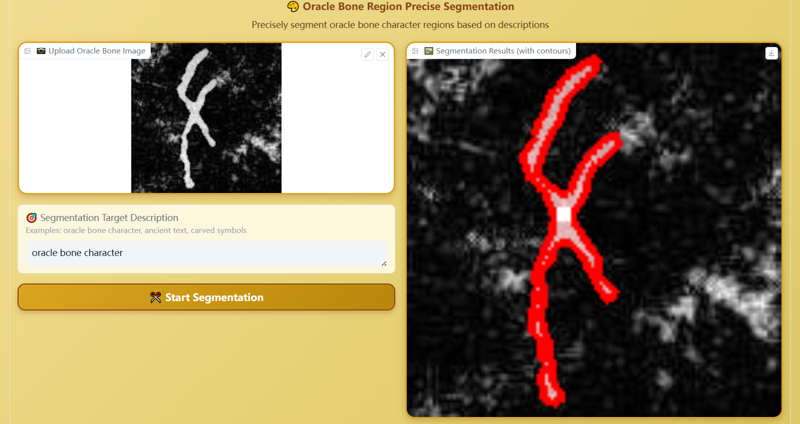
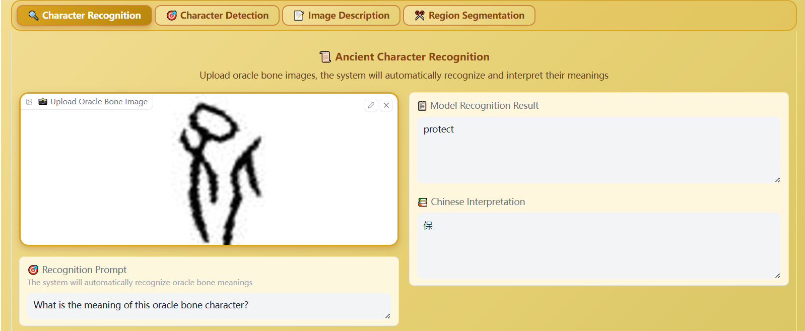

# OBIFLO - 甲骨文智能识别系统

甲骨文识别与图像处理系统，支持甲骨文字符识别、详细字幕生成、目标检测和图像分割等多种功能。

## 项目简介

OBIFLO是一个专门针对甲骨文识别开发的智能系统，利用先进的视觉-语言模型技术，为甲骨文研究提供便捷的数字化工具。能够准确识别甲骨文字符并提供中文释义。

## 主要功能

### 🔍 甲骨文识别
- 上传甲骨文图片，自动识别字符含义
- 提供英文生成答案和中文释义对照
- 支持自定义问题输入



### 📝 详细字幕生成
- 为图像生成详细的文字描述
- 适用于各种类型的图像内容分析

### 🎯 目标检测
- 检测图像中的指定目标对象
- 返回检测到的目标数量、标签和位置信息
- 默认专注于甲骨文字符检测

### ✂️ 图像分割
- 对图像中的指定区域进行精确分割
- 支持多边形轮廓提取
- 适用于复杂背景下的甲骨文字符分离




## 环境要求

```
Python 3.8+
PyTorch
Transformers
Gradio
PIL (Pillow)
Datasets
CUDA (可选，用于GPU加速)
```
在浏览器中访问生成的本地地址，开始使用系统
